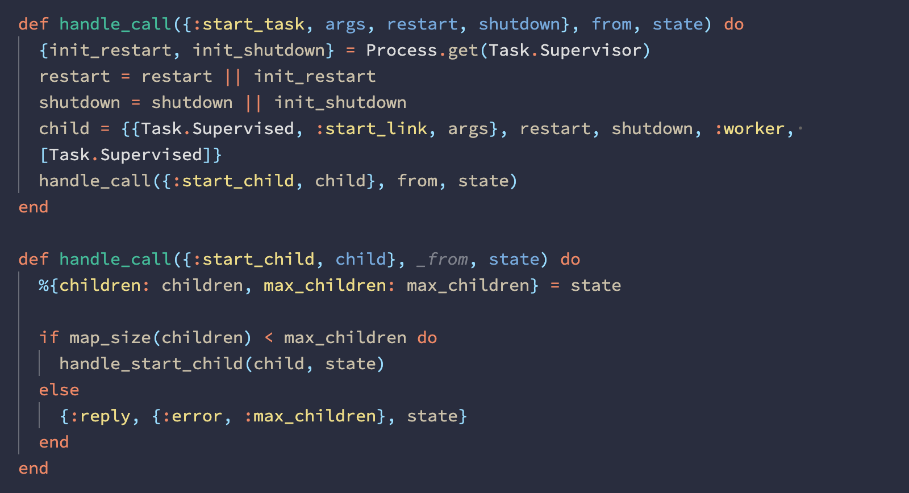

# Tol
## A comfortable and accessible dark theme for Visual Studio Code

Tol is heavily influenced by my [Yarra Valley][] theme, but uses a more muted palette developed by [Paul Tol][] for clarity and color accessibility.

## Semantic highlighting

Tol includes semantic highlighting for supported languages. Semantic highlighting provides a greater guarantee that tokens will be highlighted correctly, but may provide less nuanced highlighting.

Screenshots here are shown with semantic highlighting disabled:

```json
 "editor.semanticHighlighting.enabled": false
```

Or at the individual extension level:

```json
  "C_Cpp.enhancedColorization": "Disabled"
```

## Screenshots:

## Typescript


## React


## Elixir


## Rust (using [Rust Syntax][])


## Ruby


## Go


## Elm


## HTML


## CSS


## Python


## Markdown


## Customization

If you need to modify any of the existing colors, you can do this in your `settings.json`:

```json
"editor.tokenColorCustomizations": {
    "[Tol]": {
        "textMateRules": [
            {
                "scope": [
                    "storage.type"
                ],
                "settings": {
                    "foreground": "#ffff00"
                }
            }
        ]
    }
},
"workbench.colorCustomizations": {
    "[Tol]": {
        "editorError.foreground": "#00000000"
    }
}
```

For available options, check out the [Theme Color][] docs. Default colors are listed in [`colors.txt`][].

## Supported languages and extensions

- AsciiDoc ([AsciiDoc][])
- C ([C/C++][])
- C# ([C#][])
- C++ ([C/C++][])
- Clojure
- Crystal ([Crystal Language][])
- CSS
- Dart ([Dart Code][])
- Elixir ([ElixirLS][])
- Elm ([Elm][])
- Erlang ([erlang][])
- F# ([Ionide-fsharp][])
- Gleam ([Gleam Syntax][])
- Go ([Go][])
- GraphQL ([GraphQL][])
- Haskell ([Haskell Syntax Highlighting][])
- HTML
- Idris ([Idris][])
- Java ([Java Extension Pack][])
- JavaScript
- JavaScript React (JSX)
- Kotlin ([Kotlin Language][])
- LaTeX ([LaTeX Workshop][])
- Less
- Lua ([Lua][])
- makefile
- Markdown
- Ocaml ([reason-vscode][] or [OCaml and Reason IDE][])
- PHP
- PowerShell ([PowerShell][])
- Python ([Python][])
- R ([R][])
- Racket ([Magic Racket][])
- Reason ([reason-vscode][] or [OCaml and Reason IDE][])
- reStructuredText ([reStructuredText][])
- Ruby ([Ruby][] + [VSCode Ruby][])
- Rust ([Rust Syntax][] + [Rust][])
- Sass ([Sass][])
- Scheme ([vscode-scheme][])
- SCSS
- shell script
- SQL
- Swift ([Swift Language][])
- TOML ([Better TOML][])
- TypeScript
- TypeScript React (TSX)
- VimScript ([VimL][])
- YAML

<!--
## Planned languages:
- AHK
- Julia
- Objective-C
- Perl
- Pony
- Scala
- TLA+
- Visual Basic
- Zig
-->

[`colors.txt`]: ./colors.txt
[AsciiDoc]: https://marketplace.visualstudio.com/items?itemName=joaompinto.asciidoctor-vscode
[Better TOML]: https://marketplace.visualstudio.com/items?itemName=bungcip.better-toml
[C/C++]: https://marketplace.visualstudio.com/items?itemName=ms-vscode.cpptools
[C/C++]: https://marketplace.visualstudio.com/items?itemName=ms-vscode.cpptools
[C#]: https://marketplace.visualstudio.com/items?itemName=ms-dotnettools.csharp
[Crystal Language]: https://marketplace.visualstudio.com/items?itemName=faustinoaq.crystal-lang
[Dart Code]: https://marketplace.visualstudio.com/items?itemName=Dart-Code.dart-code
[ElixirLS]: https://marketplace.visualstudio.com/items?itemName=JakeBecker.elixir-ls
[Elm]: https://marketplace.visualstudio.com/items?itemName=Elmtooling.elm-ls-vscode
[erlang]: https://marketplace.visualstudio.com/items?itemName=pgourlain.erlang
[Gleam Syntax]: https://marketplace.visualstudio.com/items?itemName=gleam-syntax.gleam-syntax
[Go]: https://marketplace.visualstudio.com/items?itemName=ms-vscode.Go
[GraphQL]: https://marketplace.visualstudio.com/items?itemName=Prisma.vscode-graphql
[Haskell Syntax Highlighting]: https://marketplace.visualstudio.com/items?itemName=justusadam.language-haskell
[Idris]: https://marketplace.visualstudio.com/items?itemName=zjhmale.Idris
[Ionide-fsharp]: https://marketplace.visualstudio.com/items?itemName=Ionide.Ionide-fsharp
[Java Extension Pack]: https://marketplace.visualstudio.com/items?itemName=vscjava.vscode-java-pack
[Kotlin Language]: https://marketplace.visualstudio.com/items?itemName=mathiasfrohlich.Kotlin
[LaTeX Workshop]: https://marketplace.visualstudio.com/items?itemName=James-Yu.latex-workshop
[Lua]: https://marketplace.visualstudio.com/items?itemName=sumneko.lua
[Magic Racket]: https://marketplace.visualstudio.com/items?itemName=evzen-wybitul.magic-racket
[OCaml and Reason IDE]: https://marketplace.visualstudio.com/items?itemName=freebroccolo.reasonml
[Paul Tol]: https://personal.sron.nl/~pault/
[PowerShell]: https://marketplace.visualstudio.com/items?itemName=ms-vscode.PowerShell
[Python]: https://marketplace.visualstudio.com/items?itemName=ms-python.python
[R]: https://marketplace.visualstudio.com/items?itemName=Ikuyadeu.r
[reason-vscode]: https://marketplace.visualstudio.com/items?itemName=jaredly.reason-vscode
[reStructuredText]: https://marketplace.visualstudio.com/items?itemName=lextudio.restructuredtext
[Ruby]: https://marketplace.visualstudio.com/items?itemName=rebornix.Ruby
[Rust Syntax]: https://marketplace.visualstudio.com/items?itemName=dustypomerleau.rust-syntax
[Rust]: https://marketplace.visualstudio.com/items?itemName=rust-lang.rust
[Sass]: https://marketplace.visualstudio.com/items?itemName=Syler.sass-indented
[Swift Language]: https://marketplace.visualstudio.com/items?itemName=Kasik96.swift
[Theme Color]: https://code.visualstudio.com/api/references/theme-color
[VimL]: https://marketplace.visualstudio.com/items?itemName=XadillaX.viml
[VSCode Ruby]: https://marketplace.visualstudio.com/items?itemName=wingrunr21.vscode-ruby
[vscode-scheme]: https://marketplace.visualstudio.com/items?itemName=sjhuangx.vscode-scheme
[Yarra Valley]: https://marketplace.visualstudio.com/items?itemName=dustypomerleau.yarra-valley
